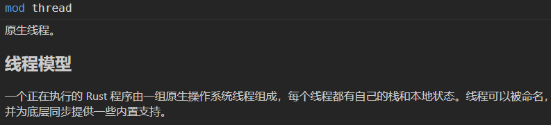
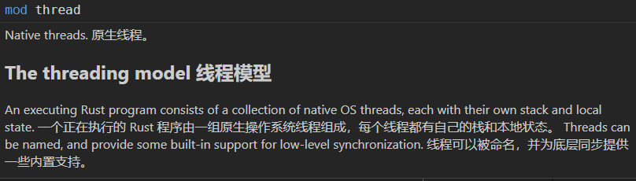
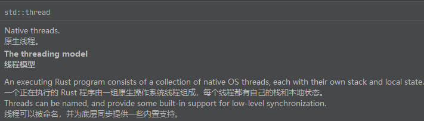

# 在 IDE 中使用 Rust 标准库中文文档

在 `dist` 目录下一共提供了两个文件，它们都是构建好的中文文档。其中一个文件的后缀是带有 `contrast` 字样。这两个文件有一些区别：

不带有 `contrast` 字样的文档是纯中文文档，英文内容都被直接替换为中文了。并且，在任何 IDE 下都可以得到相同的效果。



而带有 `contrast` 字样的文档是对照文档，是在英文语句的后面追加了中文翻译语句，实现了英中文并列显示。在不同的 IDE 中有不同的效果。

在 `vscode` 中，英中文会被合并为一行（没有解决方案）：



而在 `JetBrains` 系列 IDE 中，中英文会并列显示：



## 安装中文文档

### 通过脚本安装

#### Windows

```powershell
# 在 `Powershell` 中执行
# 该脚本会请求并执行当前项目下的 `bin/install.ps1`

powershell.exe -encodedCommand ([Convert]::ToBase64String([System.Text.Encoding]::Unicode.GetBytes((Invoke-WebRequest -Uri "https://gitee.com/wtklbm/rust-library-chinese/raw/main/bin/install.ps1").Content)))
```

#### macOS 或 Linux

```bash
# 在终端中执行
# 该脚本会请求并执行当前项目下的 `bin/install.sh`

bash <(curl -fsSLk https://gitee.com/wtklbm/rust-library-chinese/raw/main/bin/install.sh)
```

### 手动安装

-   在使用中文文档时，请注意版本号，中文文档版本和 Rust 版本号必须要保持一致。
-   必须使用 `stable` 版本的指定版本号，不能使用 `beta` 和 `nightly` 版本。
-   在翻译后的源代码中，一些文档的底部会存在一定量的内容为空的注释行，其实这是有意为之，请不要擅自修改和删除。如果您删除了它，就会导致 `source-map` 失效，当 `source-map` 失效后，在调试源代码时就会出现执行位置和源代码位置不一致的严重问题。

最新的构建结果会放在 [`dist`](../dist) 目录下，您可以手动跳转到该文件夹，下载最新的构建结果。

如果您是刚开始使用 Rust，那么请确保 Rust 已经安装好，并且可以正常工作。在 Rust 安装成功后，您还应该通过 `rustup component add rust-src` 命令来安装 `rust-src` 组件。当安装 `rust-src` 组件之后，请按照以下步骤进行操作：

1. 在终端执行：`rustup default stable` 来切换到 `stable` 版本，并确保 `stable` 的版本与中文版文档所对应的版本一致
2. 在终端执行 `rustup show home`，在输出中找到所对应的路径，然后将其在资源管理器中打开
3. 打开 `toolchains` 的文件夹，在该文件夹下，找到您当前所使用的 Rust 工具链并将其打开，例如，在 `Windows` 平台上对应的是 `stable-x86_64-pc-windows-msvc` 文件夹
4. 然后打开 `lib/rustlib/src/rust` 目录，这个目录下的文件夹就是 Rust 标准库源代码所在的位置
5. 将 `lib/rustlib/src/rust/library` 文件夹下的所有内容保存一份副本
6. 下载本仓库对应的中文文档源文件，将其重命名为 `library` 并放置到 `lib/rustlib/src/rust` 文件夹下
7. 请确保您已经在 IDE 中安装 Rust 相关插件，例如：
    - Visual Studio Code 需要安装 [rust-analyzer](https://marketplace.visualstudio.com/items?itemName=matklad.rust-analyzer)
    - JetBrains 系列需要安装 [Rust](https://plugins.jetbrains.com/plugin/8182-rust)
8. 重新启动 `IDE` 工具，中文文档的智能提示开始工作
9. 愉快的编码！

## 卸载中文文档

```bash
# 在终端执行

rustup component remove rust-src
rustup component add rust-src
```
